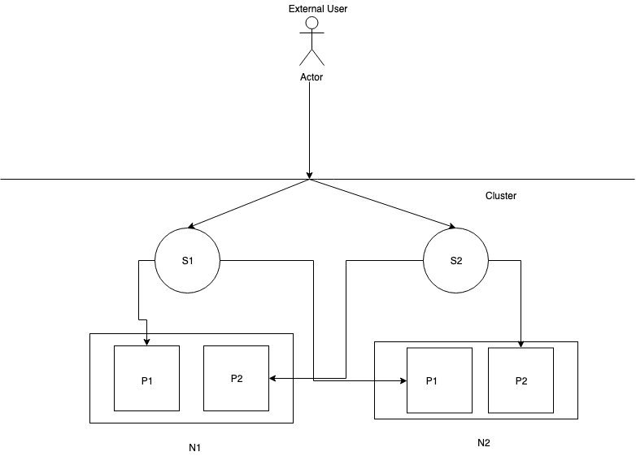

### How to setup ingress on k8s:

For this I choose minikube and mac for demonstration. 

### Prerequisites

1.  Kubectl
2.  Virtual box
3.  Pre enabled virtualization 



 P: POD, N: NODE, S: SERVICES, 

### Minikube

Minikube is easy to install and gets help you started with Kubernetes. 
It is easy to install and use.

```
minikube version

minikube version: v1.2.0

 
minikube start
 
minikube v1.2.0 on darwin (amd64)
💡  Tip: Use 'minikube start -p <name>' to create a new cluster, or 'minikube delete' to delete this one.
🔄  Restarting existing virtualbox VM for "minikube" ...
⌛  Waiting for SSH access ...
🐳  Configuring environment for Kubernetes v1.15.0 on Docker 18.09.6
🔄  Relaunching Kubernetes v1.15.0 using kubeadm ... 
⌛  Verifying: apiserver proxy etcd scheduler controller dns
🏄  Done! kubectl is now configured to use "minikube"

$ minikube status

inikube status

host: Running
kubelet: Running
apiserver: Running
kubectl: Correctly Configured: pointing to minikube-vm at 192.168.99.102

$ minikube addons enable ingress
ingress was successfully enabled

# wait a min for the pod to be up and running
get pods -n kube-system | grep nginx-ingress-controller
nginx-ingress-controller-7b465d9cf8-jxj5s   1/1     Running
```

### Check k8s

> kubectl get nodes

```
NAME       STATUS   ROLES    AGE   VERSION
minikube   Ready    master   66d   v1.15.0
```
### Deploying Application

Since, cluster is running, now lets deploy the objects.
Deployment of Pods using deployment file.
```
kubectl apply -f deployment.yml
deployment.extensions/hello-world created

kubectl get deploy
NAME                  READY   UP-TO-DATE   AVAILABLE   AGE
hello-world           2/2     2            2           111s


kubectl get pods 
NAME                                   READY   STATUS    RESTARTS   AGE
hello-world-7466dfd5d7-nrc7p           1/1     Running   0          3m36s
hello-world-7466dfd5d7-q8lrh           1/1     Running   0          3m36s

```

Now expose this pod using service.More details [here](https://kubernetes.io/docs/tutorials/kubernetes-basics/expose/expose-intro/)

```
kubectl apply -f service.yml 
service/hello-world-svc created

$ kubectl get svc
NAME                TYPE        CLUSTER-IP       EXTERNAL-IP   PORT(S)    AGE
hello-world-svc     ClusterIP   10.108.198.191   <none>        80/TCP     20s

```
TargetPort: 8080 is the port we target when we access the service. port: 80 is the port used to access the service.

Now setting up the ingress rule
```
kubectl apply -f ingress.yml 
ingress.extensions/hello-world-ingress created

$ kubectl get ing
NAME                  HOSTS   ADDRESS     PORTS   AGE
hello-world-ingress   *                   80      22s

```

This allows us to access the service meow-svc via the /meow path. Since we didn’t specify a host, then we can access it using the clusterIP.
Note the nginx.ingress.kubernetes.io/ssl-redirect annotation. It is used since we are not specifying a host. When no host is specified, then the default-server is hit, which is configured with a self-signed certificate, and redirects http to https.

### Access the application

```
$ minikube ip
192.168.99.100
$ curl 192.168.99.100/meow
```

### Troubleshoot

Read here. [Read](https://kubernetes.github.io/ingress-nginx/troubleshooting/)

### Reset Everything
```
minikube stop;
minikube delete;
rm -rf ~/.minikube ~/.kube;
# brew uninstall kubectl;
# brew cask uninstall docker virtualbox minikube;
```